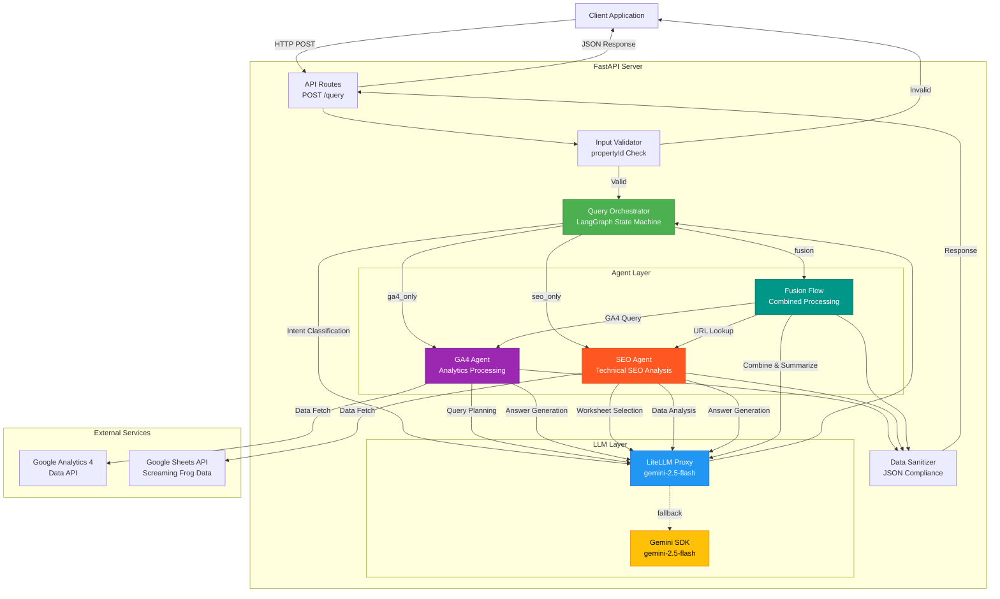
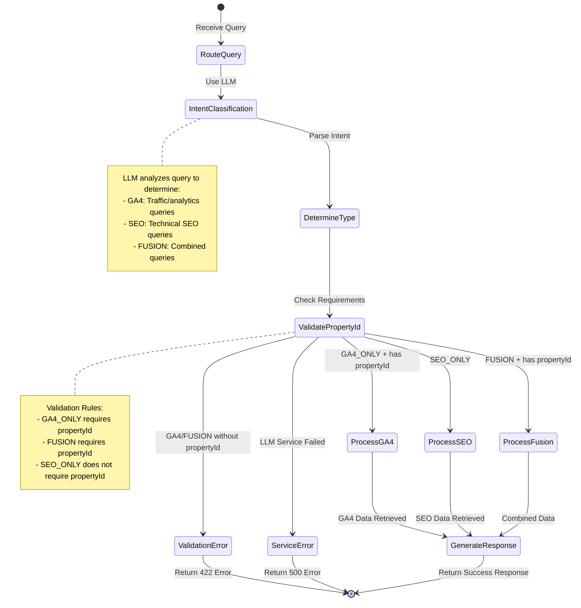
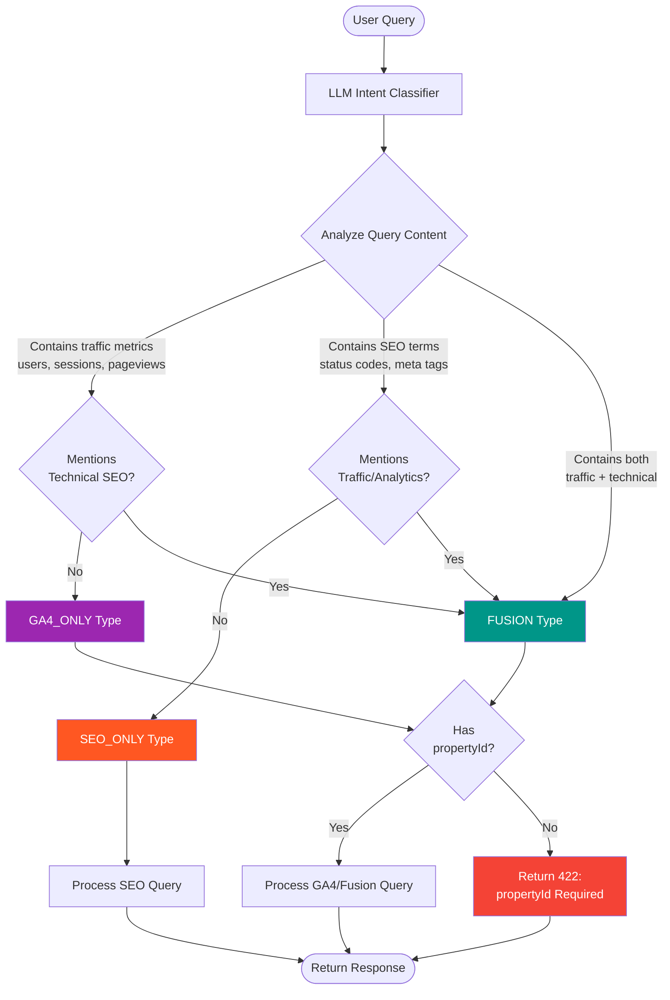
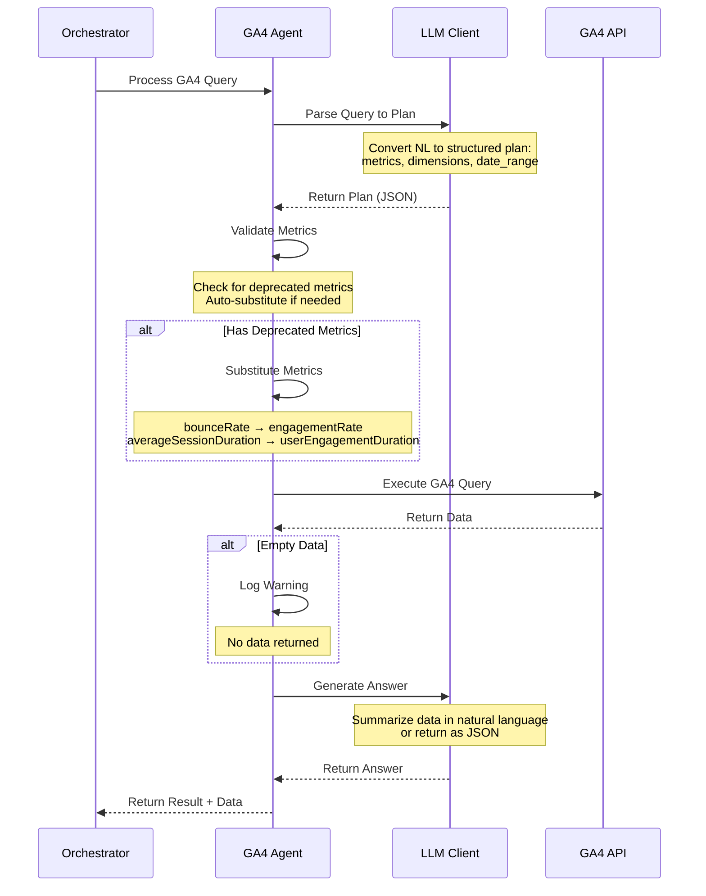
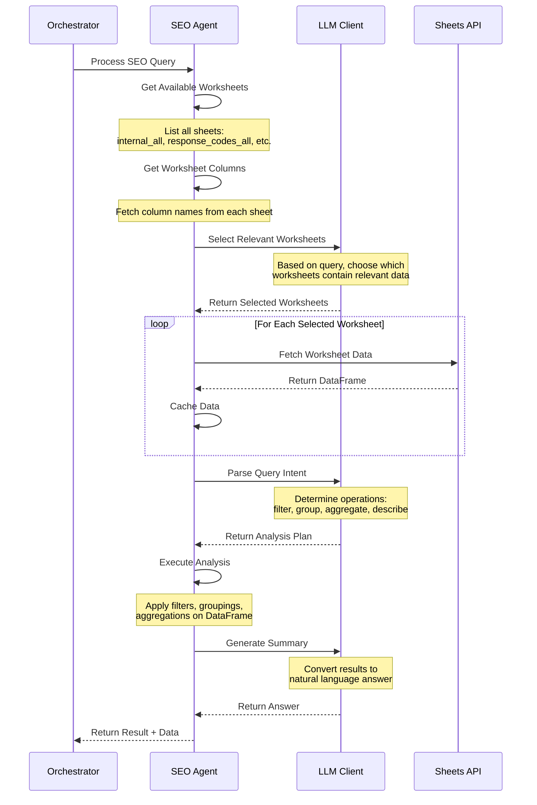
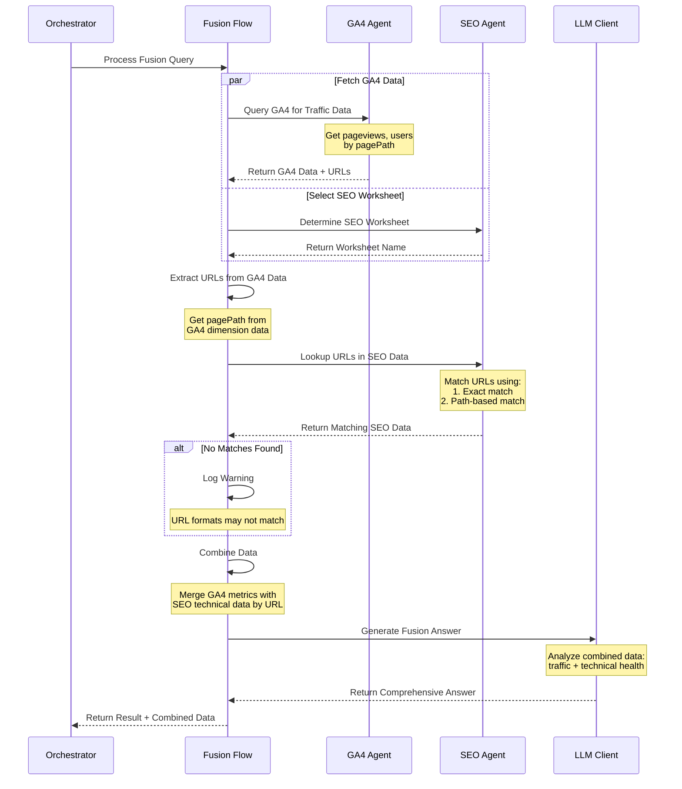
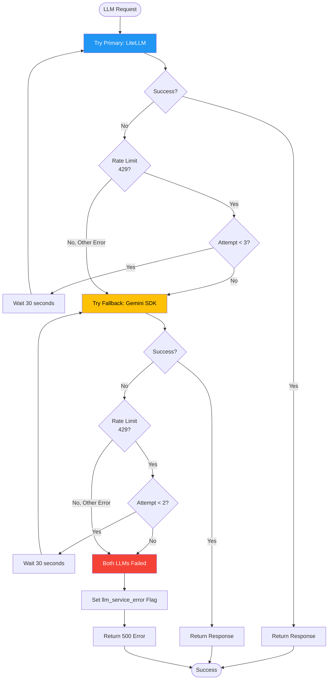
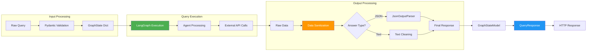
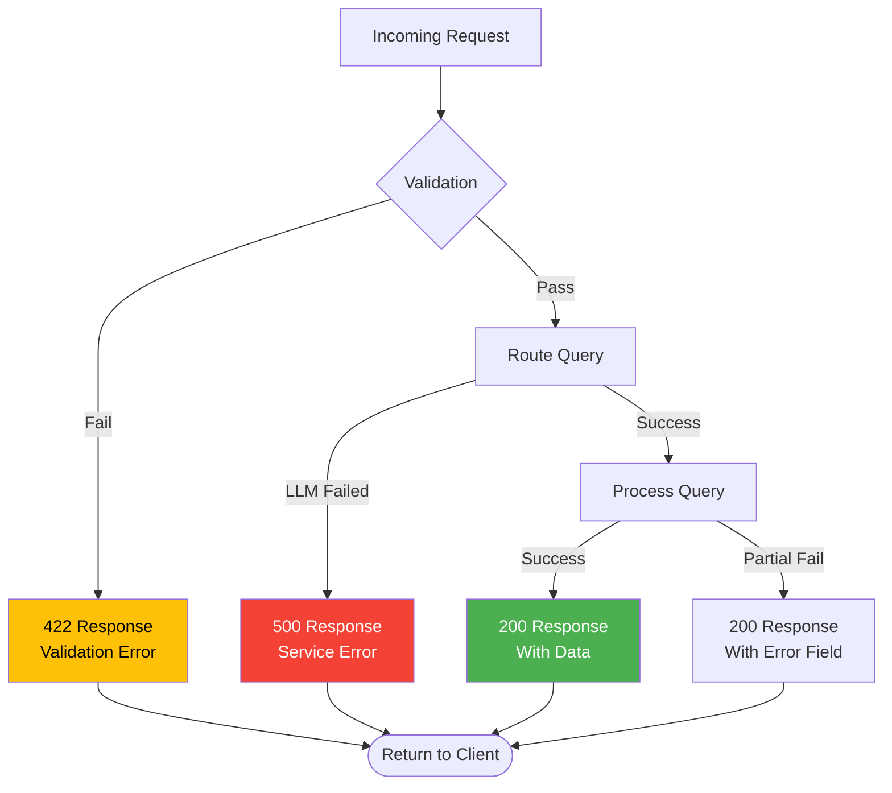

# Spike AI - Architecture Documentation

## System Overview

Spike AI is a natural language query system that intelligently routes user queries to appropriate data sources (Google Analytics 4, SEO data, or both) using LLM-powered orchestration with LangGraph.

## Architecture Diagram

### Complete System Flow



### Orchestrator State Machine (LangGraph)



### Intent Classification Flow



### GA4 Agent Workflow



### SEO Agent Workflow



### Fusion Query Workflow



### LLM Client with Fallback



### Data Flow



## Component Details

### 1. API Layer (`api/routes.py`)

**Responsibilities**:
- HTTP request handling
- Input validation
- Response formatting
- Error handling (422, 500 status codes)
- JSON parsing and sanitization

**Key Functions**:
- `POST /query`: Main query endpoint
- `GET /health`: Health check
- `GET /`: Root health check

### 2. Orchestrator (`orchestrator.py`)

**Responsibilities**:
- Query routing via LangGraph state machine
- Intent classification using LLM
- Property ID validation
- Agent coordination
- Response generation

**State Machine Nodes**:
- `route_query`: Classify query intent
- `process_ga4`: Handle GA4 queries
- `process_seo`: Handle SEO queries
- `process_fusion`: Handle combined queries
- `generate_response`: Create final answer

**Routing Logic**:
```python
GA4 Keywords: users, sessions, pageviews, traffic, conversions
SEO Keywords: status codes, meta tags, indexability, broken links
FUSION: Combination of both traffic and technical terms
```

### 3. GA4 Agent (`agents/ga4_agent.py`)

**Responsibilities**:
- Convert natural language to GA4 API queries
- Execute GA4 Data API requests
- Handle deprecated metrics
- Generate natural language answers

**Key Features**:
- Automatic metric substitution (bounceRate → engagementRate)
- Date range parsing (7daysAgo, today, etc.)
- Dimension and metric validation
- Error handling for API limits

**Supported Metrics**:
- Traffic: totalUsers, sessions, screenPageViews
- Engagement: engagementRate, userEngagementDuration
- Events: eventCount, conversions

**Supported Dimensions**:
- Time: date, year, month, day
- Content: pagePath, pageTitle
- User: country, city, deviceCategory, browser
- Traffic: source, medium, campaignName

### 4. SEO Agent (`agents/seo_agent.py`)

**Responsibilities**:
- Connect to Google Sheets with Screaming Frog data
- Intelligent worksheet selection
- Data filtering and analysis
- Generate SEO insights

**Key Features**:
- Auto-detects available worksheets
- LLM-powered worksheet selection
- DataFrame operations (filter, group, aggregate)
- URL matching for fusion queries

**Common Worksheets**:
- `internal_all`: Main crawl data
- `response_codes_all`: HTTP status
- `meta_description_all`: Meta tags
- `page_titles_all`: Title tags
- `canonicals_all`: Canonical URLs
- `images_all`: Image analysis

### 5. LLM Client (`llm_client.py`)

**Responsibilities**:
- Manage LLM API calls
- Implement retry logic with exponential backoff
- Handle fallback to Gemini
- Rate limit management

**Configuration**:
- Primary: LiteLLM proxy (customizable model)
- Fallback: Gemini native SDK
- Retry: 3 attempts with 30-second delay
- Timeout: 30 seconds per request

### 6. Utilities (`utils.py`)

**Functions**:
- `sanitize_for_json()`: Handle NaN, Infinity, numpy types for JSON compliance

## Data Models

### GraphState (LangGraph State)

```python
{
    "query": str,                    # User's natural language query
    "property_id": Optional[str],    # GA4 property ID
    "query_type": QueryType,         # GA4_ONLY | SEO_ONLY | FUSION
    "answer": Optional[str],         # Final answer
    "structured_data": Optional[Dict], # Raw data from agents
    "metadata": Dict,                # Routing info, timing, etc.
    "ga4_data": Optional[Dict],      # GA4 results
    "ga4_plan": Optional[Dict],      # GA4 query plan
    "ga4_error": Optional[str],      # GA4 error message
    "seo_data": Optional[Dict],      # SEO results
    "seo_error": Optional[str],      # SEO error message
}
```

### QueryResponse (API Response)

```python
{
    "success": bool,
    "query_type": str,
    "answer": str | object,          # Can be text or parsed JSON
    "answer_type": "text" | "json",
    "data": Optional[Dict],
    "metadata": Dict,
    "error": Optional[str]
}
```

## Error Handling

### Error Types

1. **Validation Errors (422)**:
   - Missing `propertyId` for GA4/Fusion queries
   - Invalid request format

2. **Service Errors (500)**:
   - LLM quota exceeded
   - LLM timeout
   - Both primary and fallback LLM failed

3. **Data Errors (200 with error field)**:
   - GA4 API errors
   - Google Sheets connection errors
   - No data found for query

### Error Flow



## Performance Considerations

### Caching

- SEO Agent caches worksheet data per request
- Multiple queries to same worksheet reuse cached DataFrame

### Rate Limiting

- GA4 API: Respects Google's rate limits
- LLM: 30-second retry delay on 429 errors
- Up to 3 retry attempts before fallback

### Timeouts

- LLM requests: 30 seconds
- GA4 API: 30 seconds
- Google Sheets API: 30 seconds

## Security

### API Keys

- All API keys stored in `.env` (not committed)
- Service account credentials in `credentials.json` (gitignored)

### Data Access

- Google Service Account with minimal permissions
- Read-only access to GA4 properties
- Read-only access to Google Sheets

### Input Validation

- Pydantic models validate all inputs
- SQL injection not applicable (no SQL databases)
- API key injection prevented by environment isolation

## Deployment

### Production Considerations

1. **Environment Variables**: Use secure secret management
2. **CORS**: Configure `allow_origins` appropriately
3. **Logging**: Adjust `LOG_LEVEL` to INFO or WARNING in production
4. **Monitoring**: Track LLM usage, API quotas, error rates
5. **Scaling**: Consider load balancing for high traffic

### Docker Deployment (Optional)

```dockerfile
FROM python:3.11-slim
WORKDIR /app
COPY requirements.txt .
RUN pip install -r requirements.txt
COPY . .
CMD ["python3", "main.py"]
```

## Monitoring & Observability

### Logging Levels

- **DEBUG**: Detailed data samples, intermediate steps
- **INFO**: Key milestones, routing decisions
- **WARNING**: Recoverable issues, fallbacks
- **ERROR**: Failures requiring attention

### Key Metrics

- Query processing time
- LLM response time
- Agent execution time
- Error rates by type
- LLM fallback frequency

---

**Version**: 0.1.0  
**Last Updated**: December 2025

