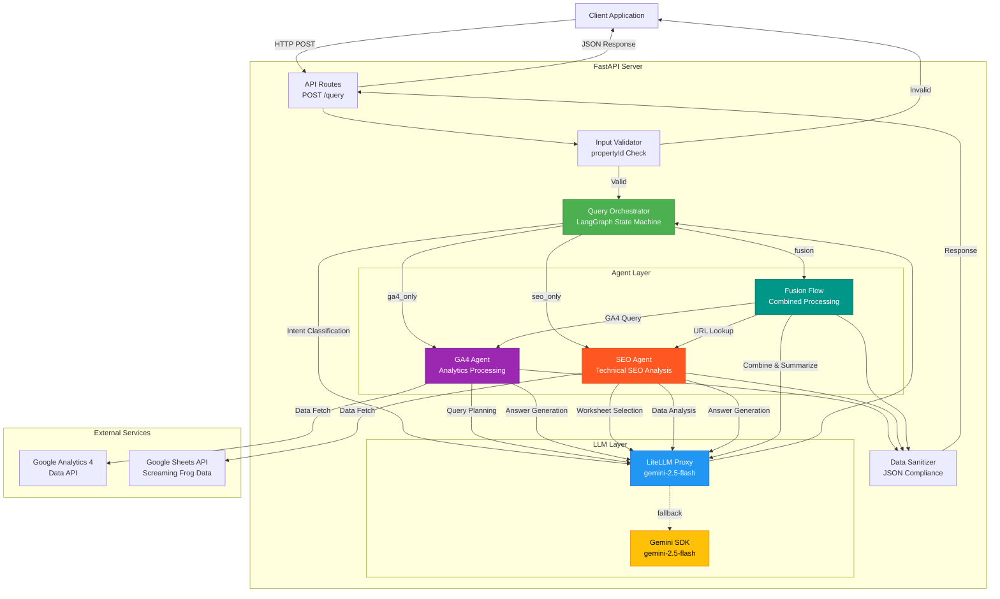

# Spike AI - Architecture Documentation

## System Overview

Natural language query system that routes user queries to GA4, SEO data, or both using LLM-powered orchestration with LangGraph.

## Complete System Flow



## Request Flow

1. **Client** sends POST request with `query` and optional `propertyId`
2. **Validator** checks if propertyId is required (GA4/Fusion queries need it)
3. **Orchestrator** uses LLM to classify intent (GA4_ONLY, SEO_ONLY, or FUSION)
4. **Agent** processes query: GA4 Agent for analytics, SEO Agent for technical data, Fusion for both
5. **Sanitizer** cleans data (handles NaN, numpy types) and formats response as text or JSON
6. **Client** receives QueryResponse with answer and structured data

## Components

### API Layer (`api/routes.py`)
HTTP request handling, input validation, response formatting, error handling (422, 500 status codes)

### Orchestrator (`orchestrator.py`)
LangGraph state machine for query routing, intent classification via LLM, propertyId validation, agent coordination

### GA4 Agent (`agents/ga4_agent.py`)
Converts natural language to GA4 API queries, handles deprecated metrics (bounceRate→engagementRate, averageSessionDuration→userEngagementDuration), generates answers

### SEO Agent (`agents/seo_agent.py`)
Connects to Google Sheets, LLM-powered worksheet selection, DataFrame operations (filter/group/aggregate), URL matching for fusion queries

### LLM Client (`llm_client.py`)
Primary LiteLLM proxy with Gemini fallback, 3 retries with 30-second delay on rate limits, 30-second timeout per request

### Utilities (`utils.py`)
`sanitize_for_json()` handles NaN, Infinity, numpy types for JSON compliance

## Data Models

**GraphState** (LangGraph):
```python
{"query": str, "property_id": Optional[str], "query_type": QueryType, "answer": Optional[str], "structured_data": Optional[Dict], "metadata": Dict, "ga4_data": Optional[Dict], "seo_data": Optional[Dict]}
```

**QueryResponse** (API):
```python
{"success": bool, "query_type": str, "answer": str|object, "answer_type": "text"|"json", "data": Optional[Dict], "metadata": Dict, "error": Optional[str]}
```

## Error Handling

- **422 Unprocessable Entity**: Missing propertyId for GA4/Fusion queries
- **500 Internal Server Error**: LLM quota exceeded, both primary and fallback LLMs failed
- **200 OK with error field**: GA4 API errors, Google Sheets errors, no data found

## Performance

- **Caching**: SEO Agent caches worksheet data per request
- **Rate Limiting**: 30-second retry delay on LLM 429 errors, up to 3 attempts before fallback
- **Timeouts**: 30 seconds for LLM, GA4 API, and Google Sheets API requests

---

**Version**: 0.1.0  
**Last Updated**: December 2025
