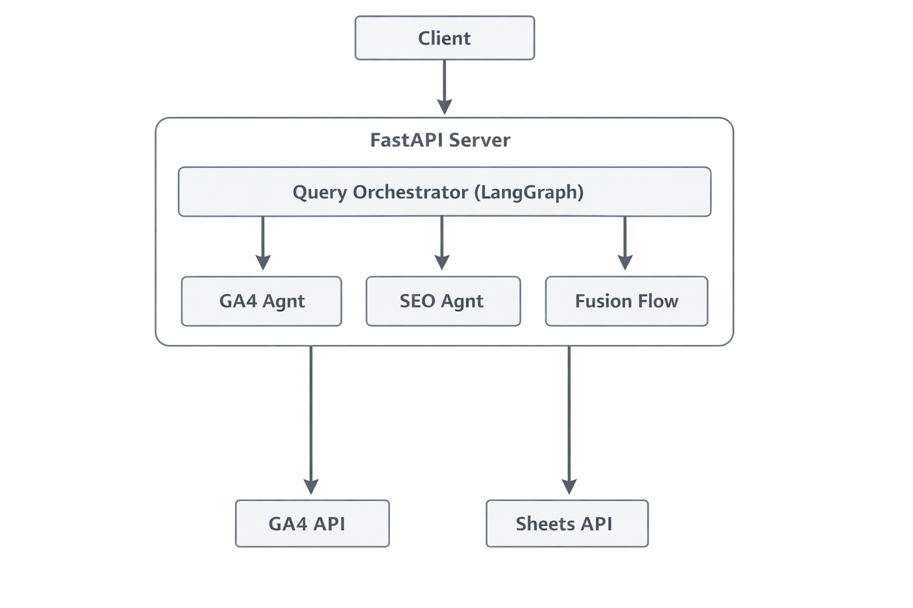

# Spike AI - Analytics & SEO Query API

Natural language query interface for Google Analytics 4 (GA4) and SEO data powered by LLMs and LangGraph orchestration.

## Overview

Spike AI enables users to query their GA4 analytics and SEO data using natural language. The system intelligently routes queries to the appropriate data sources (GA4, SEO, or both) and returns comprehensive answers.

### Key Features

- **Natural Language Processing**: Ask questions in plain English
- **Intelligent Query Routing**: Automatically determines whether to use GA4, SEO, or both data sources
- **Dual LLM Support**: Primary LiteLLM proxy with Gemini fallback for reliability
- **SEO Data Integration**: Connects to Screaming Frog data via Google Sheets
- **GA4 Integration**: Direct connection to Google Analytics 4 Data API
- **Modular Architecture**: Clean separation of concerns with agents, orchestrator, and API layers

## Architecture

See [ARCHITECTURE.md](./ARCHITECTURE.md) for detailed architecture diagrams and flow documentation.

### High-Level Components



### Query Types

1. **GA4 Only**: Pure analytics queries (users, sessions, pageviews)
2. **SEO Only**: Pure technical SEO queries (status codes, meta tags, indexability)
3. **Fusion**: Combined queries requiring both GA4 traffic data and SEO technical data

## Prerequisites

- Python 3.9+
- Google Cloud Project with GA4 API enabled
- Google Service Account with GA4 access
- Google Sheets with Screaming Frog SEO data
- LiteLLM API key (or OpenAI API key)
- Gemini API key (for fallback)

## Quick Start

### 1. Clone and Setup

```bash
git clone <repository-url>
cd spike-ai
```

### 2. Environment Configuration

Copy the example environment file:

```bash
cp .env.example .env
```

Edit `.env` with your credentials:

```env
# LLM Configuration
LITELLM_API_KEY=your_litellm_key
LITELLM_BASE_URL=https://your-litellm-proxy.com
GEMINI_API_KEY=your_gemini_key
LLM_MODEL=gemini-2.5-flash
LLM_FALLBACK_MODEL=gemini-2.5-flash

# Google Cloud / GA4
GOOGLE_APPLICATION_CREDENTIALS=credentials.json

# Google Sheets
SCREAMING_FROG_SHEET_ID=your_sheet_id

# Server
PORT=8080
HOST=0.0.0.0
LOG_LEVEL=DEBUG
```

### 3. Google Credentials

Place your Google Service Account credentials in `credentials.json` at the project root.

### 4. Deploy

```bash
./deploy.sh
```

The script will:
- Install all dependencies
- Start the server in the background
- Follow logs in real-time

### 5. Test the API

```bash
# Health check
curl http://localhost:8080/health

# Example query
curl -X POST http://localhost:8080/query \
  -H "Content-Type: application/json" \
  -d '{
    "query": "What are the top 5 pages by pageviews in the last 7 days?",
    "propertyId": "123456789"
  }'
```

## Data Source Integrations

### Google Analytics 4 (GA4)

**Purpose**: Traffic and user behavior analytics

**Integration**:
- Uses Google Analytics Data API (v1beta)
- Requires service account with Viewer permissions
- Supports metrics: users, sessions, pageviews, engagement rate, etc.
- Supports dimensions: date, pagePath, country, device, etc.

**Configuration**:
- Set `GOOGLE_APPLICATION_CREDENTIALS` in `.env`
- Ensure service account has GA4 property access
- Provide `propertyId` in API requests

### Screaming Frog SEO Data (via Google Sheets)

**Purpose**: Technical SEO analysis

**Integration**:
- Connects to Google Sheets containing Screaming Frog crawl data
- Auto-detects relevant worksheets based on query
- Analyzes: status codes, meta tags, content, links, indexability

**Configuration**:
- Export Screaming Frog data to Google Sheets
- Share sheet with service account email
- Set `SCREAMING_FROG_SHEET_ID` in `.env`

**Expected Worksheets**:
- `internal_all`: Main crawl data
- `response_codes_all`: HTTP status codes
- `meta_description_all`: Meta descriptions
- `page_titles_all`: Page titles
- `canonicals_all`: Canonical tags
- And more (system auto-detects)

### LLM Services

**Primary**: LiteLLM Proxy
- Custom proxy for multiple LLM providers
- Handles rate limiting and retries
- 30-second retry delay on rate limits

**Fallback**: Gemini (Native SDK)
- Direct Google Gemini API integration
- Activates when primary LLM fails
- No dependency on Vertex AI

## Usage Examples

### GA4 Queries

```json
{
  "query": "Give me daily pageviews for the last 14 days",
  "propertyId": "123456789"
}
```

```json
{
  "query": "What are the top traffic sources?",
  "propertyId": "123456789"
}
```

### SEO Queries

```json
{
  "query": "Are there any broken pages (non-200 status codes)?"
}
```

```json
{
  "query": "Show me pages with missing meta descriptions"
}
```

### Fusion Queries

```json
{
  "query": "What are the top 5 pages by traffic and are they technically healthy?",
  "propertyId": "123456789"
}
```

```json
{
  "query": "Show me high-traffic pages with SEO issues",
  "propertyId": "123456789"
}
```

## Project Structure

```
spike-ai/
├── main.py                 # FastAPI application entry point
├── config.py              # Settings and configuration
├── models.py              # Pydantic models for API
├── orchestrator.py        # LangGraph orchestration logic
├── llm_client.py          # LLM wrapper (LiteLLM + Gemini)
├── utils.py               # Utility functions
│
├── api/                   # API routes
│   ├── __init__.py
│   └── routes.py          # Endpoint handlers
│
├── agents/                # Data source agents
│   ├── __init__.py
│   ├── ga4_agent.py      # Google Analytics 4 agent
│   └── seo_agent.py      # SEO data agent
│
├── scripts/               # Utility scripts
│   ├── check_data_ga4.py
│   └── backdated_data_ingestion.py
│
├── .env.example           # Environment variables template
├── requirements.txt       # Python dependencies
├── deploy.sh             # Deployment script
├── README.md             # This file
└── ARCHITECTURE.md       # Detailed architecture documentation
```

## Development

### Development Mode

Start with auto-reload:

```bash
python3 main.py --dev
```

### Stop Server

```bash
kill $(cat spike_ai.pid)
```

### View Logs

```bash
tail -f spike_ai.log
```

## API Reference

### POST /query

Process a natural language query.

**Request Body**:
```json
{
  "query": "string (required) - Natural language query",
  "propertyId": "string (optional) - GA4 property ID, required for GA4 and Fusion queries"
}
```

**Response**:
```json
{
  "success": boolean,
  "query_type": "ga4_only" | "seo_only" | "fusion" | "unknown",
  "answer": "string or JSON object",
  "answer_type": "text" | "json",
  "data": object | null,
  "metadata": {
    "processing_time_ms": number,
    "routing": object
  },
  "error": string | null
}
```

**Status Codes**:
- `200`: Successful query processing
- `422`: Validation error (e.g., missing propertyId for GA4 query)
- `500`: Server error (e.g., LLM service unavailable)

### GET /health

Health check endpoint.

**Response**:
```json
{
  "status": "healthy" | "degraded",
  "version": "0.1.0",
  "services": {
    "orchestrator": "healthy" | "unavailable",
    "timestamp": "ISO 8601 timestamp"
  }
}
```

## Assumptions & Limitations

See [ASSUMPTIONS.md](./ASSUMPTIONS.md) for detailed assumptions and open questions.

### Key Assumptions

1. **GA4 Data Availability**: Assumes GA4 property is correctly configured and service account has access
2. **SEO Data Format**: Expects Screaming Frog export format in Google Sheets
3. **LLM Availability**: Requires at least one working LLM service (primary or fallback)
4. **Query Language**: Optimized for English language queries
5. **Date Ranges**: GA4 queries default to 2017-01-01 to today if not specified

### Known Limitations

1. **GA4 Metrics**: Some deprecated metrics (bounceRate, averageSessionDuration) are auto-substituted with modern equivalents
2. **URL Matching**: Fusion queries rely on exact or path-based URL matching between GA4 and SEO data
3. **Rate Limits**: Subject to GA4 API and LLM service rate limits
4. **Real-time Data**: GA4 data may have 24-48 hour delay
5. **Large Datasets**: Performance may degrade with very large SEO datasets (10k+ URLs)

## Contributing

1. Follow the existing code style
2. Add tests for new features
3. Update documentation
4. Use meaningful commit messages


## Troubleshooting

### Common Issues

**Issue**: "Google credentials file not found"
- **Solution**: Ensure `credentials.json` is in the project root

**Issue**: "LLM service temporarily unavailable"
- **Solution**: Check API keys in `.env`, verify quota limits

**Issue**: "No URL matches found" in fusion queries
- **Solution**: Verify GA4 URLs match format in Screaming Frog data

**Issue**: "Missing required parameter: propertyId"
- **Solution**: Include `propertyId` in request for GA4/fusion queries

### Debug Mode

Set `LOG_LEVEL=DEBUG` in `.env` for detailed logging.

## Support

For issues and questions:
- Check [ARCHITECTURE.md](./ARCHITECTURE.md) for system details
- Review [ASSUMPTIONS.md](./ASSUMPTIONS.md) for known limitations
- Check logs: `tail -f spike_ai.log`

---

**Version**: 0.1.0  
**Last Updated**: December 2025

